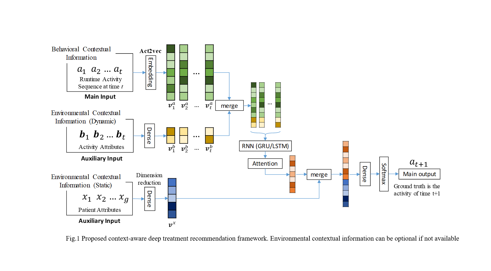
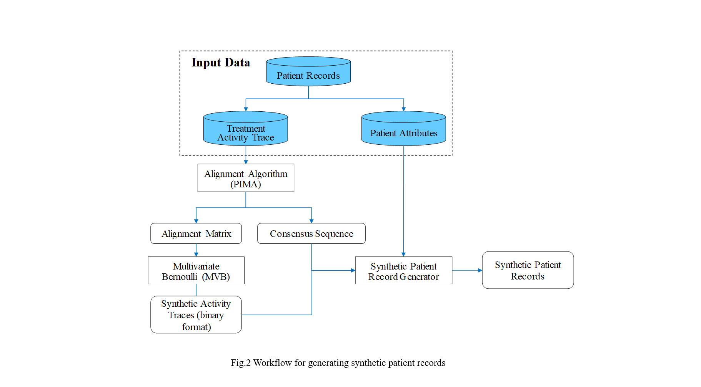

# Deep_treatment_recommender
Code for submitted PKDD paper: A Context-Aware Deep Learning Framework for Next Medical Treatment Activity Recommendation

The codes include two different parts:
+ RNNs for activity recommendation
+ Synthetic patient record generation algorithm

We are not able to provide the authentic data as it is not allowed by the protocol of our project.

Alternatively, we provided the synthetic desensitized patient records generated using the algorithm we proposed in this paper. Here is a summary of the data provided:
+ 1000 synthetic intubation patient records (1000 activity traces with patient attributes)

More synthetic patient records can be generated using the synthetic patient record generator we provided. The algorithm details can be found in Alg.1 in our paper and the implementation is described below. 

## Summary of Our Methods:
### Context-Aware Deep Treatment Recommender

The recommender system (Fig. 1) built on an RNN. The RNN takes as input the concatenation of the activity embedding vectors $v^a$ (main input) and the activity attribute vectors $v^b$ (auxiliary input (optional), dynamic environmental context). The latent vector outputs from the RNN go through our attention layer and then merged with the patient attribute vector $v^x$ (auxiliary input, static environmental context).  For the final output, we used a densely connected layer after the merging layer followed by a top-k softmax activation function. The most probable k activities will be shown to the medical team as the recommended treatment for the next step (t+1). In practice, the dynamic contextual information will be updated by our sensor-based activity recognition system or by the nurse recorder who has access to the computerized decision support system.

### Synthetic Patient Record Generator

As described in the paper, there are three steps to generate the synthetic patient records:
1. Align the activity traces to acquire the alignment matrix
2. Fit the alignment matrix to the Multivariate Bernoulli distribution and generate random activity traces
3. Generate synthetic patient records with attributes

For step.1, we implemented the PIMA algorithm, details can be found in 2017 ICDM workshop paper ["Process-Oriented Iterative Multiple Alignment for Medical Process Mining"](https://ieeexplore.ieee.org/document/8215695/). For step.2, the method is based on the methodology proposed by [Demirtas and and Doganay](https://www.ncbi.nlm.nih.gov/pubmed/22251171) and called the R package [BinNor](https://cran.r-project.org/web/packages/BinNor/BinNor.pdf) 

## Dependencies
Python 3.5+, Tensorflow 1.2+, Keras, numpy, pandas, pickle, h5py, rpy2
R 3.4+
Jupyter Notebook

## Running
### Running Deep Treatment Recommender
Simply run:
```
./test.sh
```

Or pick the model in `activity_predictor_intubation.py` and run:
```
python3 activity_predictor_intubation.py {MODEL_INDEX}
```
Please note the accuracy showing during the model training does not reflect the actual accuracy because of lack-of-masks. This is a limitation of keras implementation. Permute/Reshape layers used in the attention layer does not support masks. Hence the final test accuracy (and top-k accuracy) is calculated by our function tools.py/get_all_scores(). 
### Running Synthetic Patient Record Generator
Step.1: Calculate the alignment matrix:
```
cd trace_alignment
python3 pima_algo.py
```
The input file is activity traces (e.g., 'trace_alignment/Synthetic_activityTraces_1000.csv')
The output file is alignment matrix (e.g., 'trace_alignment/alignment.csv')

Step.2: Fit alignment matrix result into a Multivariate Bernoulli distribution and generate synthetic activity traces:
```
jupyter notebook
data_augmentation/dataAugmentor.ipynb
```

Step.3: Generate synthetic patient records with attributes:
```
cd data_augmentation
python3 synthetic_patient_record_generator.py
python3 log_preprocess_withId.py # convert data format from csv to pkl
python3 attribute_preprocess.py # convert data format from csv to pkl
```

